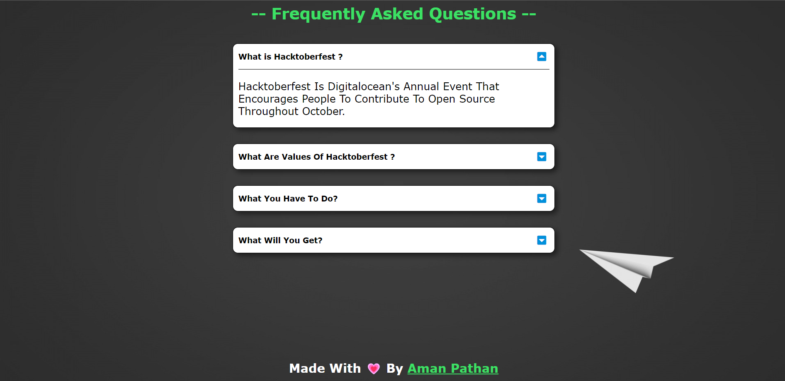

# FAQ - website 

This website is a example of FAQ-website.
When you open one question then another question closes automatically.
You can use this project as a reference.

**Note:** No extra stylesheet or library is used. It is basic use of HTML, CSS and Javascript.

## Screenshots

